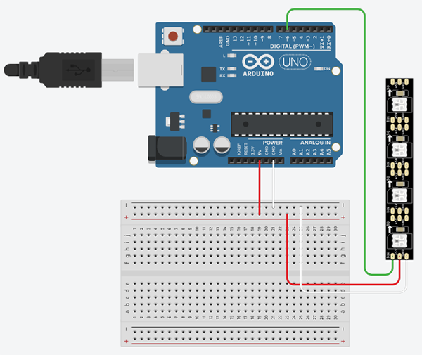

# Arduino and a 32x8 Matrix

A basic example of controlling a 32x8 colour LED matrix using an Arduino.

## Arduino Code

Open up [Arduino Create](https://create.arduino.cc/editor/) and add the following code:

```cpp

#include <Adafruit_GFX.h>
#include <Adafruit_NeoMatrix.h>
#include <Adafruit_NeoPixel.h>

int dinPin = 6

Adafruit_NeoMatrix matrix = Adafruit_NeoMatrix(
  32, 8, dinPin,
  NEO_MATRIX_TOP + NEO_MATRIX_LEFT + NEO_MATRIX_COLUMNS + NEO_MATRIX_ZIGZAG,
  NEO_GRB + NEO_KHZ800);

const uint16_t colors[] = {
  matrix.Color(255, 0, 0), 
  matrix.Color(0, 255, 0), 
  matrix.Color(0, 0, 255) };

void setup() {
  matrix.begin();
  matrix.setTextWrap(false);
  matrix.setBrightness(10);
  matrix.setTextColor(colors[0]);  
}

int pass = 0;

void loop() {
  matrix.fillScreen(0);
  matrix.setCursor(0, 0);
  matrix.print(F("Hello"));
  if(++pass >= 3) pass = 0;
  matrix.setTextColor(colors[pass]);
  matrix.show();
  delay(3000);
}
```

> [View the Arduino code on Arduino Create](https://create.arduino.cc/editor/professoradam/fe090e79-149b-4d55-98e8-682fb8adbaf3/preview)

## Circuit

You will need to setup the following circuit using your Arduino:



> [!Note]  
> The NeoPixel strip in the Tinkercard diagram can be repalced with the 32x8 matrix (or any NeoPixel set of lights)

> [View the Circuit on Tinkercad](https://www.tinkercad.com/things/caUy9e68xmM)

> Full tutorial URL:  
> https://codeadam.ca/learning/arduino-45in1.html

***

## Repo Resources

* [Visual Studio Code](https://code.visualstudio.com/)
* [Arduino Create](https://create.arduino.cc/editor) 

<br>
<a href="https://codeadam.ca">

</a>
